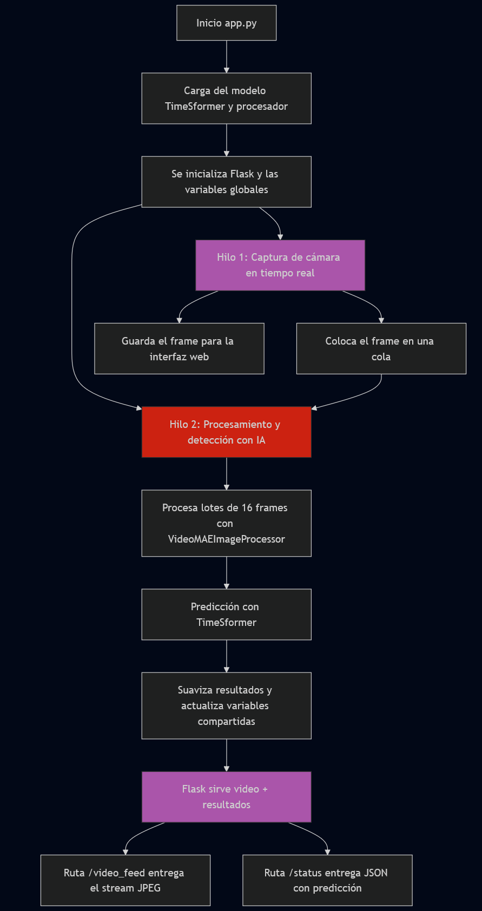

# TimeSformer Violence Detector

Este proyecto implementa un detector de violencia en video utilizando la arquitectura **TimeSformer** (Transformer para video). Fine-tuneado para identificar comportamientos violentos en secuencias temporales y ejecutado en una app web con Flask.

## ¿Qué hace?

- Recibe una transmicion en vivo.
- Utiliza un modelo basado en `TimeSformer` fine-tuneado.
- Detecta comportamientos violentos y devuelve la predicción.

## Funcionamiento
Al ejecutar app.py ocurre lo siguiente:

## Capturas

## Docker (in contruction)
